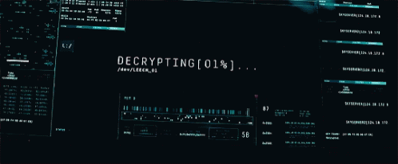

   

# CV_DylanSantiagoTrujilloRomero
# Hoja de Vida

   

## Dylan Santiago Trujillo Romero
**Profesión:** Analista y Desarrollador de Software

## 📞 Contacto
- **Email:** [dylantrujillo.romero@gmail.com](mailto:dylantrujillo.romero@gmail.com)
- **LinkedIn:** [linkedin.com/in/tuusuario](https://linkedin.com/in/tuusuario)

## 🏢 Experiencia Laboral
### **SENA** _(2026 - Actualidad)_
- Python
- Java Script
- HTML

## 🎓 Educación
### **SENA** _(2026 - Actualidad)_
- Aprendiz de Analisis y Desarrollo de Software
- Fernando Mazuera Villegas (2024)
  - Tecnico en Instalación de Redes Eléctricas Domiciliarias.
  - Bachiller. 

## 💡 Habilidades
- **Soy una persona motivada**
- **Siempre mantengo una buena disposicion para aprender y colaborar**
- **Analiso los problemas y busco la solución más acorde**
- -**Trabajo en equipo**

